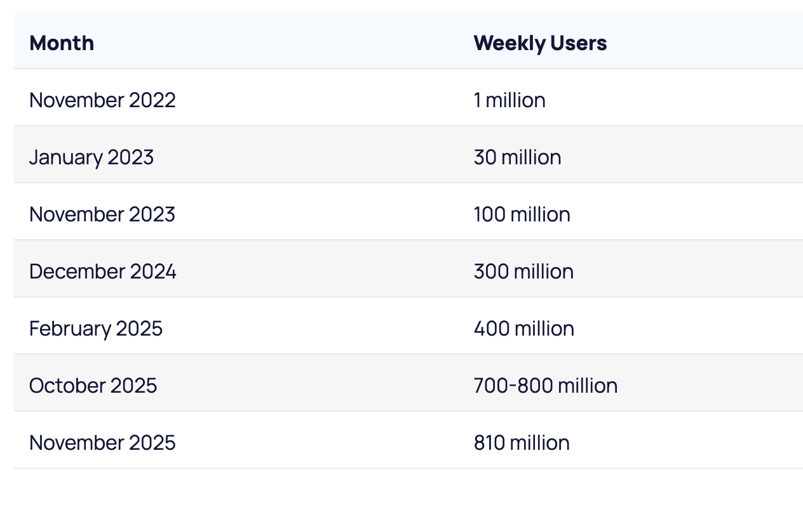
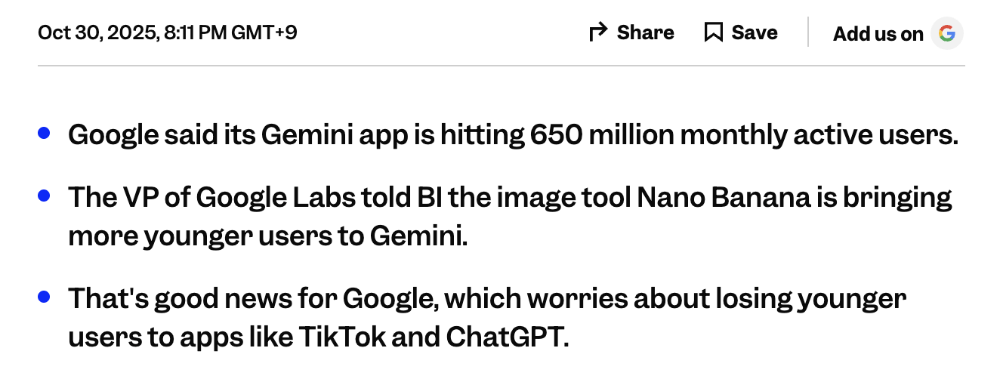
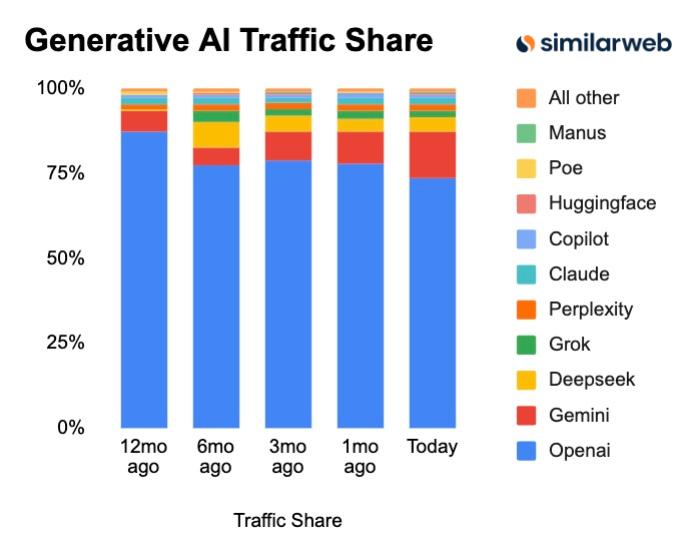
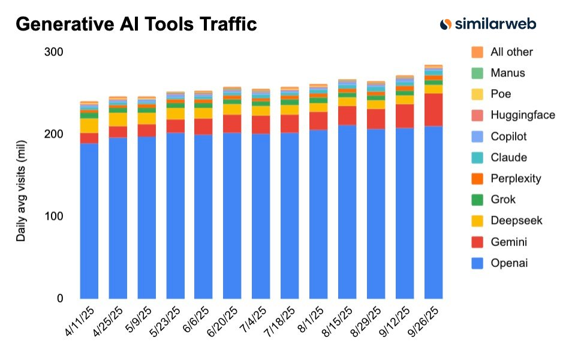

# KakaoTalk

[카카오톡은 2025.09.23 대규모 ui 업데이트를 진행했다.](https://namu.wiki/w/2025%EB%85%84%20%EC%B9%B4%EC%B9%B4%EC%98%A4%ED%86%A1%20%EB%8C%80%EA%B0%9C%ED%8E%B8) 친구 목록과 프로필이 인스타그램 피드 형태로 바뀐 것이 주 업데이트 내용이었다.

그리고 이 업데이트는 소비자 입장에서 정말 짜증나는 변화였다. 개인 공간으로 여기던 카카오톡이 공개적으로 변한 것이었다. 많은 사람들이 분개했고, 다른 메신저로의 대규모 이동 조짐도 보였다.

하지만 데이터를 보면 많은 사람들이 분개했던 것과는 다르게 [카카오톡의 MAU와 실사용자는 크게 줄지 않았다.](https://www.hankyung.com/article/202511180069g)  
이는 네트워크 효과로 인한 것으로 판단된다. 주위 지인들과 업무적으로 만나는 사람들이 대부분 카카오톡을 사용하기에, 메신저를 옮긴다고 해서 더 큰 효용이 발생하지 않는 것이다.

---

# ChatGPT

이번엔 ChatGPT 얘기를 해보고자 한다. [ChatGPT는 2달만에 MAU 1억명을 기록했다.](https://zdnet.co.kr/view/?no=20230203153950) 이는 틱톡보다도 빠를 정도로 인터넷 등장 이후 가장 빠른 속도로 평가받는다.

**하지만 현재 ChatGPT는 빠른 속도로 Gemini에 따라잡히는 중이다.**

2025년 10월 기준 ChatGPT의 MAU는 약 8억명(WAU지만.. 자료가 없어서 대략 추정)이었으며, Gemini의 MAU는 약 6.5억명이었다. 거의 따라잡힌 모양새이다.

&lt;왼쪽이 ChatGPT MAU, 오른쪽이 Gemini MAU&gt;

<div className="grid grid-cols-2 gap-4">
  <div></div>
  <div></div>
</div>

이는 사이트 트래픽 비중을 비교하면 더 쉽게 알 수 있다. SimilarWeb에 따르면 생성형 AI 사이트의 트래픽 비중 중 Gemini가 차지하는 부분이 상당히 증가한 것을 알 수 있다.

<div className="grid grid-cols-2 gap-4">
  <div></div>
  <div></div>
</div>

즉, 현재 생성형 AI는 경쟁이 치열할 뿐만 아니라 선두주자로 여겼던 ChatGPT가 대기업에 의해 빠른 속도로 따라잡히고 있다. 물론 아직 경쟁은 진행 중이며 ChatGPT가 시장을 독점하고, 새로운 방법을 찾아낼 가능성이 여전히 남아있다. 하지만 여기서의 시사점은 스타트업이 좋은 기술을 기반으로 시장에 진입하더라고 대기업과의 경쟁은 정말 어렵다는 점이다.

그렇다면 스타트업이 대기업을 이기는 것은 불가능한 걸까? 카카오톡과 ChatGPT를 가르는 핵심적인 차이점은 무엇이었을까?

---

# Zero to One

Zero to One에서 피터 틸이 얘기하는 먼 미래까지 높은 수익이 예상되는 독점기업에는 4가지 특징이 있다.

```diff
+ 10배 더 뛰어난 기술
+ 네트워크 효과
+ 규모의 경제
+ 브랜드 전략
```

이 중 몇가지가 결합되면 독점기업으로서 가치를 획득(Value Capture)하고 높은 수익을 장기간 거둘 수 있다.  
하지만 최근 사례들을 보면 가장 강력하고, 스타트업이 대기업을 이길 수 있는 핵심은 네트워크 효과로 사료된다.

<Callout type="idea">

- 10배 더 뛰어난 기술은 대기업이 마음만 먹으면 생각보다 빠르게 따라잡을 수 있음
- 규모의 경제는 소프트웨어 서비스라면 기본적으로 보유함
- 브랜드 전략은 물론 핵심적이지만 구조적으로 갖추기 어려울 수 있음

</Callout>

물론 생성형 AI 시장은 매우 빠르게 변하고 있고, 새로운 기술이 나타나 시장을 장악할 수도 있다. OPENAI 역시 많은 시도들을 하고 있고, 그 중 어떤 것들이 성공하여 Gemini를 따돌릴 수도 있다. 하지만 결국 구조를 기반으로 경쟁하지 않고 이기려면 네트워크 효과는 필수이다.

> 따라서 AI 서비스를 만들더라도 네트워크 효과가 들어간 서비스를 만들어야 한다.  
> 네트워크 효과가 확보된 AI 서비스, 그것이 내가 나아가야 할 방향이다.
